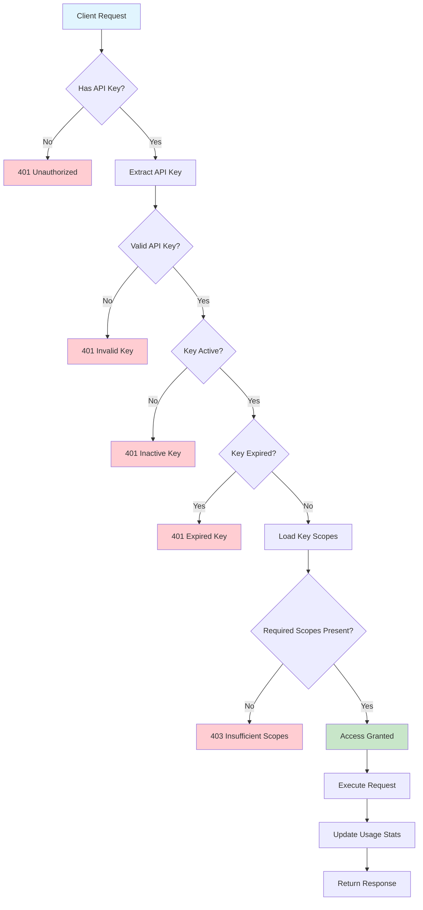

# NestJS API Key Management System

A comprehensive NestJS application demonstrating API key authentication, MongoDB integration, and scope-based access control.

## 🎥 Demo Video

Watch the system in action:

[](api-key-demo.mov)

_Click the badge above or download `api-key-demo.mov` to see the complete demonstration of the API key management system._

## 🚀 Quick Start

### Prerequisites

- Node.js (v16 or higher)
- Docker & Docker Compose (recommended) OR MongoDB (v4.4 or higher)
- npm or yarn
- [Postman](https://www.postman.com/) (for testing)

### Installation

1. **Clone and setup**

   ```bash
   git clone <repository-url>
   cd nestjs-api-key-example
   npm install
   ```

2. **Environment setup**

   Create a `.env` file in the root directory:

   ```env
   NODE_ENV=development
   PORT=3000
   MONGODB_URI=mongodb://localhost:27017/nestjs-api-key-db
   JWT_SECRET=your-jwt-secret-key-here
   API_KEY_PREFIX=ak_
   ```

3. **Start services**

   ```bash
   # Start MongoDB
   docker-compose up -d

   # Start the application
   npm run start:dev
   ```

## 🧪 Testing with Postman

The easiest way to test the API is using the provided Postman collection:

1. **Import the collection**

   - Open Postman
   - Click "Import"
   - Select the `postman-collection.json` file from this repository
   - The collection will be imported with all endpoints pre-configured

2. **Set up environment variables**

   - Create a new environment in Postman
   - Add variable: `baseUrl` = `http://localhost:3000`
   - The collection uses this variable for all requests

3. **Start testing**
   - Use the "Create API Key" request to generate your first API key
   - Copy the returned API key
   - Use it in subsequent requests to test protected endpoints

## 🔐 Authentication & Authorization Flow



### Flow Explanation

1. **Request Arrives**: Client sends request with API key in header
2. **Key Validation**: System checks if API key exists and is valid
3. **Status Check**: Verifies key is active and not expired
4. **Scope Validation**: Compares required scopes with key's assigned scopes
5. **Access Control**: Grants or denies access based on scope match
6. **Usage Tracking**: Records successful API usage for analytics

## 🎯 Key Features

- 🔐 **Secure API Key Generation**: Cryptographically secure key generation
- 🎯 **Scope-Based Access Control**: Fine-grained permissions system
- 🗄️ **MongoDB Integration**: Persistent storage with Mongoose
- 📊 **Usage Analytics**: Track API key usage patterns
- ⚡ **Rate Limiting**: Built-in protection against abuse
- 🔄 **Full CRUD Operations**: Complete API key lifecycle management
- 📝 **Comprehensive Logging**: Detailed audit trails

## 📚 Documentation

For detailed information about specific features:

- [Scope System Documentation](SCOPE_SYSTEM.md) - Learn about the structured scope system
- [Quick Start Guide](QUICK_START.md) - Step-by-step setup instructions
- [Docker Setup](DOCKER.md) - Containerized deployment options

## 🛠️ Development

### Available Scripts

```bash
# Development
npm run start:dev

# Production
npm run build
npm run start:prod

# Testing
npm run test
npm run test:e2e
npm run test:cov

# Code Quality
npm run lint
npm run format
```

## 🔒 Security Best Practices

- Store API keys securely (never in client-side code)
- Use HTTPS in production environments
- Implement rate limiting for API protection
- Regularly monitor API key usage
- Rotate keys periodically
- Grant minimum required scopes
- Set appropriate expiration dates

## 🤝 Contributing

1. Fork the repository
2. Create a feature branch
3. Make your changes
4. Add tests for new functionality
5. Submit a pull request

## 📄 License

This project is licensed under the MIT License.
